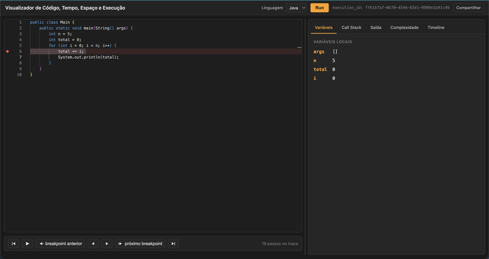
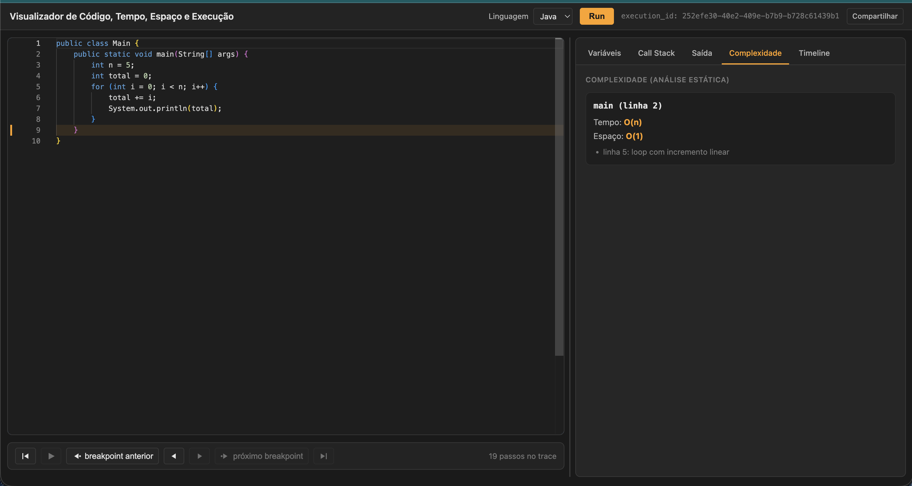

# Visualizador de Código, Tempo, Espaço e Execução

## Ideia

Uma plataforma web onde você escreve código e vê, em tempo real:

- Complexidade temporal (O(n), O(n²), O(log n)...) e espacial
- Execução linha a linha
- Variáveis locais e call stack em cada passo
- Tempo de execução e uso de memória
- stdout / stderr
- Visualização gráfica da execução

Na prática: um IDE + debugger + profiler + analisador de Big-O, tudo junto, rodando em tempo real.





## Como funciona

```
  Você escreve código no editor
              │
              ▼
      ┌───────┴───────┐
      │               │
      ▼               ▼
  Analisa o        Executa o
  código sem       código de
  rodar (AST)       verdade
      │               │
      ▼               ▼
  Estima a         Roda isolado
  complexidade      numa sandbox,
  (Big-O)          capturando cada
      │            passo (linha,
      │            variáveis, tempo,
      │            memória...)
      │               │
      └───────┬───────┘
              ▼
     Tudo isso volta pro
     navegador em tempo real
```

Duas coisas acontecem em paralelo com o código que você escreve: uma **análise estática** (lê o código e estima a complexidade, sem executar nada) e uma **execução real** (roda o código de verdade, isolado, e observa o que acontece passo a passo).

## Segurança

Código de usuário é tratado como não confiável. Toda execução roda isolada, sem acesso à rede, com limites de tempo, memória e processos, e é descartada depois de rodar.

## Linguagens

Java, C# e Ruby, hoje. A arquitetura não é presa a uma linguagem específica — dá pra adicionar outras depois.

---

Especificação técnica (API, stack, infraestrutura de sandbox) em [`spec.md`](./spec.md). Backlog de implementação em [`tasks.md`](./tasks.md).
